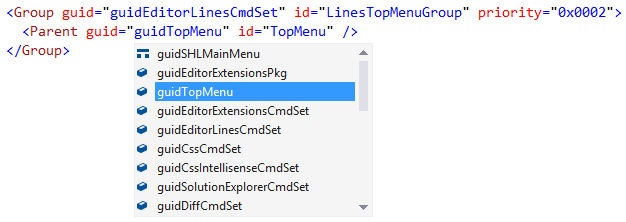
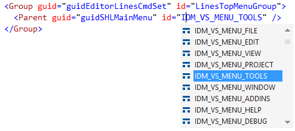
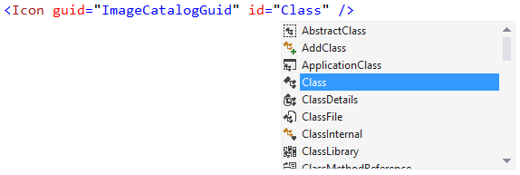
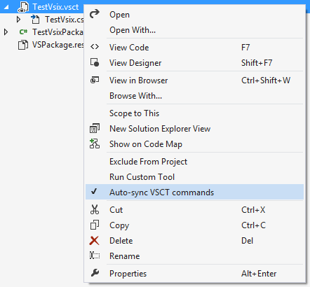
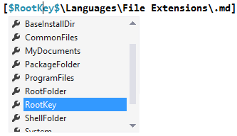

## Extensibility Tools for Visual Studio

An extension built for and by Visual Studio extension writers.

Download this extension from the [VS Gallery](https://visualstudiogallery.msdn.microsoft.com/ab39a092-1343-46e2-b0f1-6a3f91155aa6)
or get the [nightly build](http://vsixgallery.com/extension/f8330d54-0469-43a7-8fc0-7f19febeb897/).

### VSCT files
The Visual Studio Command Table leaves a lot to be desired in terms of
both Intellisense and discoverability of even the most common use cases.

This extension improves on that. 

#### Intellisense for custom GUIDs
Get Intellisense for symbols and groups through out the .vsct file
whether you're defining `Groups`, `Menus`, `Buttons`, `KeyBindings` or 
`CommandPlacements`.

#### Intellisense for custom IDs
Provides Intellisense for IDs based on the `guid` attribute on
the same XML element.

#### Intellisense built-in groups and menus
All the built-in groups and menus are located under the `guidSHLMainMenu`
GUID and Intellisense is now provided for all the corresponding IDs.

#### ImageMoniker Intellisense
Over 3500 images is available as ImageMonikers in the KnownMonikers
collection in VS. You can now see all the images directly inside
Intellisense.

#### Snippets
All main XML elements in the VSCT file has snippets associated with
them and can be invoked by hitting the Tab key.

#### Auto-sync VSCT commands
Auto-generate the `GuidList` and `PackageCommand` classes every time
you save the VSCT file. This keeps your code in sync with the VSCT file
at all times.

*Feature contributed by [phofman](https://github.com/phofman/)*

### Editor margin
The margin is located below the bottom scrollbar and comes in handy
when writing extensions that extends the VS editor.

#### Document encoding
Shows the encoding of the current document and more details on hover.

#### Content type
Shows the content type of the textbuffer at the caret position. The
over tooltip shows the name of the base content type.

#### Classification
Displays the name of the classification at the caret position in the
document. The hover tooltip shows the inheritance hierarchy of the
`EditorFormatDefinition`'s `BaseDefinition` attribute.

#### Selection
Displays the start and end position of the editor selection as
well as the total length of the selection.

### Pkgdef files

#### Syntax highlighting
Colorizes registry keys, strings, keywords, comments and more.

#### Intellisense
Intellisense is provided for tokens and GUIDs.

#### Snippets
By typing a question mark on an empty line, a list of snippets appear.
Hit `Tab` on the snippet you want and it will be inserted.

#### Brace matching
Matches parantheses and square brackets.

#### Validation
Validates various common mistakes like unknown tokens and unclosed strings and braces.

#### Formatting
Format the entire document or just the selected lines.

### Show Project Information
A context-menu command is available on every project type that
makes it very easy to see all the properties on said project.

This makes it easy to troubleshoot and debug project related issues.